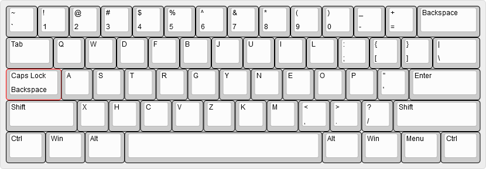
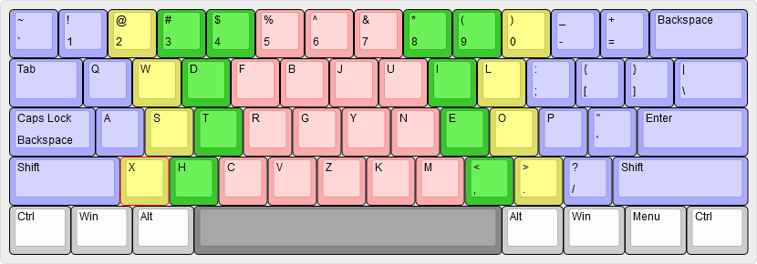

# Keyboard Template AutoHotKey Scripts

This is a collection of [AutoHotKey](https://www.autohotkey.com/) scripts for using the [Minimak](http://www.minimak.org/), [Workman](https://workmanlayout.org), and my own "Workmini" keyboard layouts without changing hotkey locations.

What this means is that the keys are updated for input but not when using Ctrl or Alt! So keyboard shortcuts like Ctrl+D or Ctrl+Shift+P in Sublime Text still work using the regular positions of the keys so your muscle memory doesn't get messed up.

These scripts also replace Caps Lock with Backspace, which I think is a great idea. You can still access Caps Lock's functionality by holding Shift while pressing Caps Lock.

You can also toggle any of the layouts by either right-clicking the Tray menu and choosing "Pause" and "Resume" or by holding Left Alt and pressing Right Alt!

## `minimak.ahk`

Running this script will change your keyboard layout to Minimak 4-key, which can be toggled to different versions from the Tray menu. The script starts with just the 4-key option set, but you can right-click the Tray icon to choose between the 8- and 12-key versions on the fly!

## `workman.ahk`

Running this script will change your keyboard layout to the regular Workman layout. You can switch to "Programmer" mode, which swaps the Shift key entries for the number keys, the `` ` `` key, and the `[` and `]` keys.

## `workmini.ahk`

This one is my own creation, which combines things I like about Minimak and Workman ands adds some additional changes based on both of their concepts, namely "keeping close to QWERTY" and "reducing lateral finger movement". These concepts combined with the ubiquity of staggered-key keyboards as opposed to [ortholinear](https://blog.roastpotatoes.co/review/2015/09/20/ortholinear-experience-atomic/) ones produced the following result:

It changes 17 keys, which is only 5 more than Minimak and 4 fewer than Workman:

The biggest difference is the bottom left corner of the keyboard, which changes the keys to `X` and `H` while moving `Z` to the bottom center. This was done because on a staggered keyboard, the fingers on my left naturally curl to cover `Left Shift`, `Z`, `X`, and `C` instead of `Z`, `X`, `C`, and `V` as a non-staggered keyboard might allow. Because of this, I moved some more useful keys to where my left ring and middle fingers curl. Other than that, it's a fairly straightforward mashup of the two, favoring Minimak a little bit more than Workman.

For reference, here is a map of which keys my fingers use (blue = pinky, yellow = ring, green = middle, red = index):

## Conclusion

I'm not here to say my Workmini keyboard layout is _better_ than the other two represented here, but I sure do like where I ended up with it more than I like the others after working with each for a little while!
